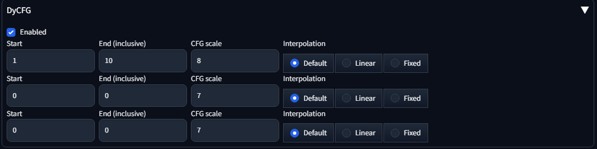
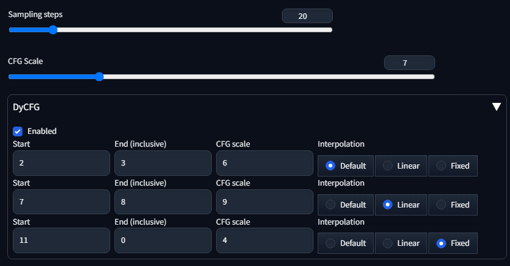

# DyCFG - Dynamic CFG Scale

## Cover

CFG scale 8.0 to 2.0.

https://github.com/hnmr293/sd-webui-dycfg/assets/120772120/3dd60565-5fcc-4a65-b345-ecd9d71da820

https://github.com/hnmr293/sd-webui-dycfg/assets/120772120/eb8505ab-f75e-4c6c-b346-7120d106ec98

## What is this?

This is an extension for [stable-diffusion-webui](https://github.com/AUTOMATIC1111/stable-diffusion-webui) which lets you to change CFG scale dynamically.

## Usage

1. Select `Enabled` checkbox.
2. Put the first step, the last step and CFG scale to the input boxes.
3. Generate images.



```
Start: the starting step of specified CFG scale.
End: the last step of specified CFG scale (inclusive). 0 is treated as max steps.
CFG scale: the scale value which will be used in Start..End steps.
Interpolation: the CFG scale interpolation mode (described below).
```

If both of `Start` and `End` are set to 0, the row will be ignored.

### Interpolation modes

Specify CFG scale interpolation mode for `End+1`..`Start-1` steps.

- `Default`: use default CFG scale.
- `Linear`: linear interpolation between `End+1` and `Start-1`.
- `Fixed`: use last (`End+1`) CFG scale.

for example, with following setting, CFG scale values will be:
`[7.0, 6.0, 6.0, 6.75, 7.5, 8.25, 9.0, 9.0, 9.0, 9.0, 4.0, 4.0, 4.0, 4.0, 4.0, 4.0, 4.0, 4.0, 4.0, 4.0]`



1. Step 1 is not specified and the first interpolation mode is `Default`. Then webui's CFG scale 7.0 is used.
2. Step 2 and 3 is specified, CFG scale = 6.0.
3. Step 4 to 6 is not specified and the second interpolation mode is `Linear`. The last CFG scale (at step 3) is 6.0 and the next CFG scale (at step 7) is 9.0. Then we get CFG scales 6.75 (at step 4), 7.50 (at step 5) and 8.25 (at step 6).
4. Step 7 and 8 is specified, CFG scale = 9.0.
5. Step 9 and 10 is not specifed and the third interpolation mode is `Fixed`. The last CFG scale (at step 8) is 9.0. Then we get CFG scales 9.0 (at step 9) and 9.0 (at step 10).
6. Step 11 to 20 is specified, CFG scale = 4.0. Note that 0 means the last step.


## Examples

```
Sampler: DPM++ 3M SDE
Sampling steps: 30
Size: 768x768
Prompt: close up of a cute girls sitting in flower garden, clear anime face, insanely frilled white dress, small silver tiara, absurdly long brown hair, long sleeves highneck dress, evil smile
Negative Prompt: (low quality, worst quality:1.4), maid, opened mouth, sleeveless, dutch angle
```


```
Model: 7th_anime_v3_A
Sampler: DPM++ 2M Karras
Sampling steps: 20
Size: 768x768
Prompt: close up of a cute girls sitting in flower garden, clear anime face, insanely frilled dress, small tiara, absurdly long brown hair, long sleeves highneck dress, evil smile
Negative Prompt: (low quality, worst quality:1.4), maid, opened mouth, sleeveless, dutch angle
```


